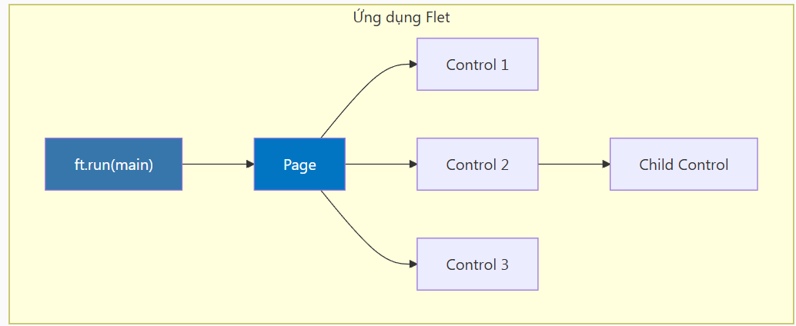
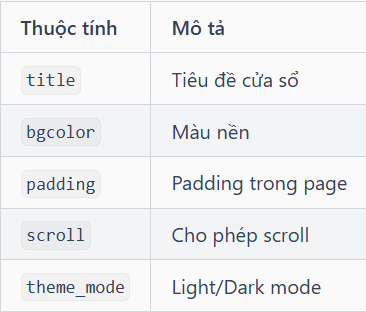

## **Kiến trúc tổng quan**

## **Page: Cửa sổ chính**

**Page** là container gốc của ứng dụng

    def main(page: ft.Page):
        # Cấu hình page
        page.title = "Tiêu đề cửa sổ"
        page.window.width = 400
        page.window.height = 600
        page.bgcolor = ft.Colors.WHITE
        page.padding = 20
        
        # Căn chỉnh nội dung
        page.vertical_alignment = ft.MainAxisAlignment.CENTER
        page.horizontal_alignment = ft.CrossAxisAlignment.CENTER

## **Các thuộc tính Page thường dùng**

## **Controls - Các thành phần UI**

    ### Text
    ft.Text("Xin chào", size=20, color=ft.Colors.BLUE)
    ### Button
    ft.ElevatedButton("Click me", on_click=handle_click)
    ### TextField
    ft.TextField(label="Nhập tên", hint_text="Tên của bạn")
    ### Image
    ft.Image(src="https://example.com/image.png", width=200)

## **Thêm Controls vào Page**
- Cách 1: page.add() - Thêm vào cuối

- Cách 2: page.controls - Truy cập trực tiếp list

## **Entry Point: ft.run()**

    ft.run(
        main,
        view=ft.AppView.WEB_BROWSER,  # Mở trong browser
        port=8080,                     # Port cho web
    )

## **Declarative Components (Flet 0.80+)**
**[!TIP]** @ft.component biến hàm thành component có thể tái sử dụng. Chúng ta sẽ học chi tiết ở bài Components & Observables.

## **Cấu trúc dự án gợi ý**
Tổ chức code theo **feature** (tính năng), chỉ share những gì thực sự dùng chung:

    my-flet-app/
    ├── main.py                 # Entry point
    ├── features/               # Các tính năng
    │   ├── auth/               # Feature: Authentication
    │   │   ├── login_view.py
    │   │   ├── register_view.py
    │   │   └── auth_state.py
    │   ├── home/               # Feature: Home
    │   │   ├── home_view.py
    │   │   └── home_components.py
    │   └── settings/           # Feature: Settings
    │       ├── settings_view.py
    │       └── theme_picker.py
    ├── shared/                 # Chỉ những gì THỰC SỰ dùng chung
    │   ├── components/         # UI components tái sử dụng
    │   │   ├── button.py
    │   │   └── input_field.py
    │   ├── theme.py            # Theme configuration
    │   └── utils.py            # Utility functions
    └── assets/                 # Hình ảnh, fonts
        └── logo.png

