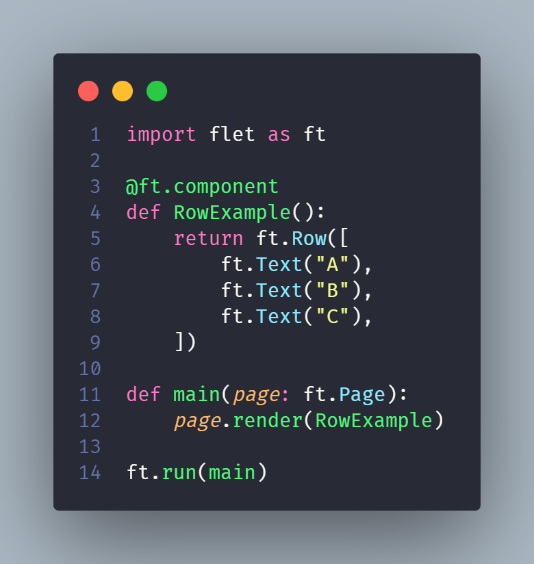
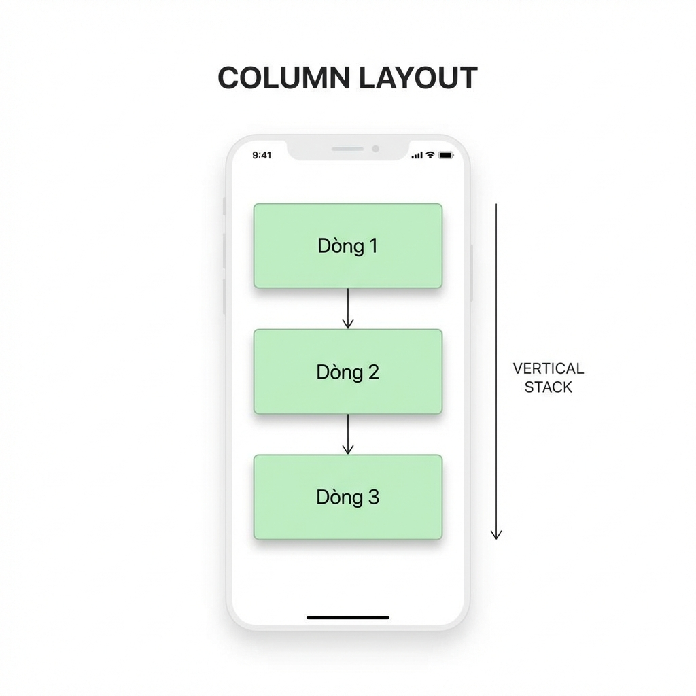
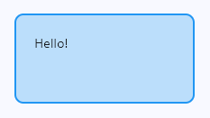
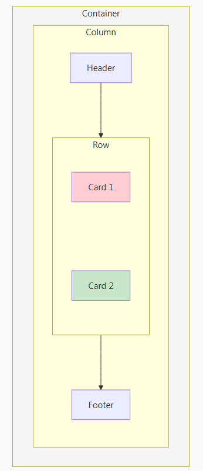
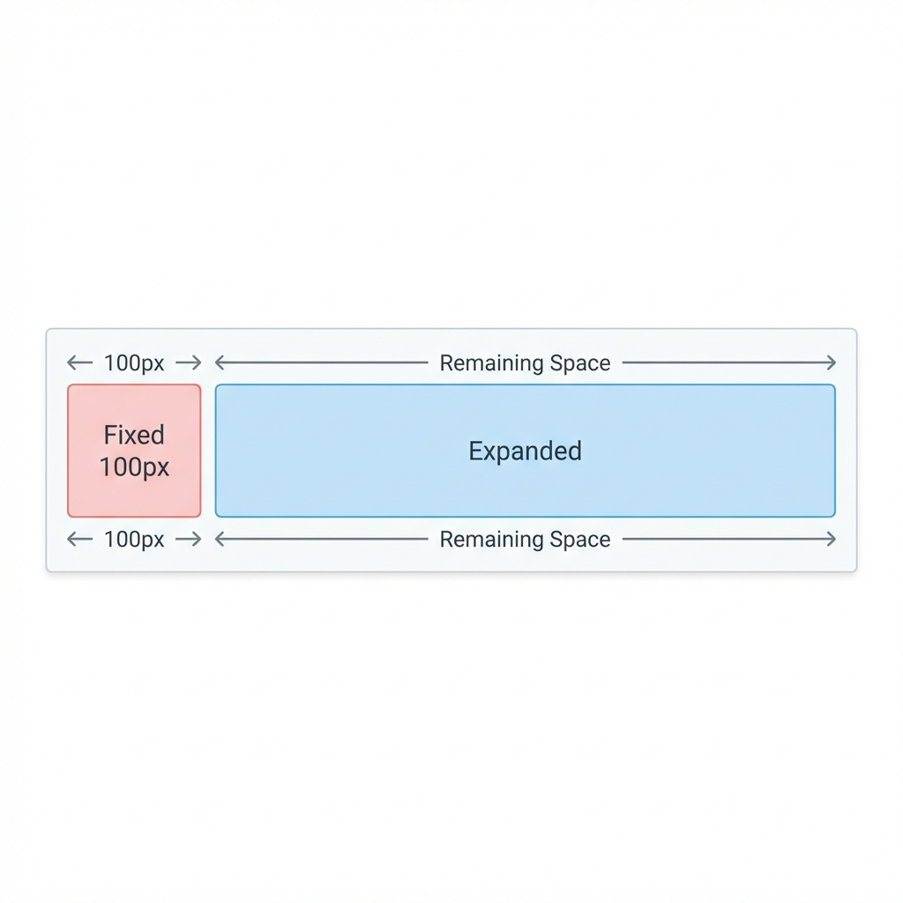

## **Row - Sắp xếp theo hàng ngang**

**Row** xếp các controls theo chiều ngang:

**Căn chỉnh Row**

    ft.Row(
        controls=[...],
        alignment=ft.MainAxisAlignment.CENTER,       # Căn giữa theo trục chính (ngang)
        vertical_alignment=ft.CrossAxisAlignment.CENTER,  # Căn giữa theo trục phụ (dọc)
        spacing=10,  # Khoảng cách giữa các controls
    )

## **Column - Sắp xếp theo cột dọc**

**Column** xếp các controls theo chiều dọc:

**Căn chỉnh Column**

    ft.Column(
        controls=[...],
        alignment=ft.MainAxisAlignment.CENTER,  # Căn giữa theo trục chính (dọc)
        horizontal_alignment=ft.CrossAxisAlignment.CENTER,  # Căn giữa theo trục phụ (ngang)
        spacing=10,
        scroll=ft.ScrollMode.AUTO,  # Cho phép scroll nếu dài
    )

## **Container - Wrapper với styling**

**Container** bọc một control và thêm styling:

    ft.Container(
        content=ft.Text("Hello!"),
        width=200,
        height=100,
        bgcolor=ft.Colors.BLUE_100,
        padding=20,
        margin=10,
        border_radius=10,
        border=ft.border.all(2, ft.Colors.BLUE),
    )

**Output:**

**Thuộc tính Container**

**Cấu trúc layout**

    import flet as ft

    @ft.component
    def CardLayout():
        return ft.Container(
            content=ft.Column([
                ft.Text("Header", size=24, weight=ft.FontWeight.BOLD),
                ft.Row([
                    ft.Container(
                        content=ft.Text("Card 1"),
                        bgcolor=ft.Colors.RED_100,
                        padding=20,
                        border_radius=8,
                    ),
                    ft.Container(
                        content=ft.Text("Card 2"),
                        bgcolor=ft.Colors.GREEN_100,
                        padding=20,
                        border_radius=8,
                    ),
                ]),
                ft.Text("Footer"),
            ]),
            padding=20,
        )

    def main(page: ft.Page):
        page.render(CardLayout)

    ft.run(main)

**Output:**

**expand - Mở rộng để lấp đầy**

    ft.Row([
        ft.Container(content=ft.Text("Fixed"), width=100, bgcolor=ft.Colors.RED_100),
        ft.Container(content=ft.Text("Expanded"), expand=True, bgcolor=ft.Colors.BLUE_100),
    ])

hoặc

    ft.Row([
        ft.Container(content=ft.Text("1"), expand=1, bgcolor=ft.Colors.RED_100),
        ft.Container(content=ft.Text("2"), expand=2, bgcolor=ft.Colors.BLUE_100),
    ]) # Container 2 chiếm gấp đôi Container 1

