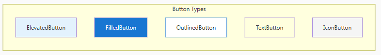

## **Controls phổ biến trong Flet**

**Text - Hiển thị văn bản**

    ft.Text("Xin chào!")
    
    # Với styling
    ft.Text(
        "Tiêu đề",
        size=24,
        weight=ft.FontWeight.BOLD,
        color=ft.Colors.BLUE,
        italic=True,
    ) 

**Button - Các loại nút**

**TextField - Nhập liệu**

    ft.TextField(
        label="Email",
        hint_text="example@email.com",
        prefix_icon=ft.Icons.EMAIL,
        on_change=lambda e: print(e.control.value),
    )

    # Password
    ft.TextField(label="Mật khẩu", password=True)
    
    # Multiline
    ft.TextField(label="Mô tả", multiline=True, max_lines=5)
    
    # Number only
    ft.TextField(label="Tuổi", keyboard_type=ft.KeyboardType.NUMBER)
    
    # Read-only
    ft.TextField(value="Không thay đổi được", read_only=True)

**Image - Hiển thị ảnh**

    # Từ URL
    ft.Image(
        src="https://picsum.photos/200",
        width=200,
        height=200,
        border_radius=ft.BorderRadius.all(10),
    )
    
    # Từ file local (trong thư mục assets)
    ft.Image(src="logo.png", width=100)

**Checkbox**

    ft.Checkbox(
        label="Tôi đồng ý điều khoản",
        value=False,
        on_change=lambda e: print(e.control.value),
    )

**Switch - Công tắc**

    ft.Switch(
        label="Bật thông báo",
        value=True,
        on_change=toggle_notifications,
    )

**Slider - Thanh kéo**

    ft.Slider(
        min=0,
        max=100,
        value=50,
        divisions=10,
        label="{value}%",
        on_change=lambda e: print(e.control.value),
    )

**Radio - Chọn một**

    ft.RadioGroup(
        content=ft.Column([
            ft.Radio(value="small", label="Nhỏ"),
            ft.Radio(value="medium", label="Vừa"),
            ft.Radio(value="large", label="Lớn"),
        ]),
        on_change=lambda e: print(e.control.value),
    )

**Dropdown**

    ft.Dropdown(
        options=[
            ft.dropdown.Option(key="option1", text="Option 1"),
            ft.dropdown.Option(key="option2", text="Option 2"),
            ft.dropdown.Option(key="option3", text="Option 3"),
        ],
        on_select=lambda e: print(e.control.value),
    )

**Icon - Biểu tượng**

    ft.Icon(ft.Icons.FAVORITE, color=ft.Colors.RED, size=40)    

**ProgressBar & ProgressRing**
    ft.ProgressBar(value=0.3, width=500, height=10)

    ft.ProgressRing()

