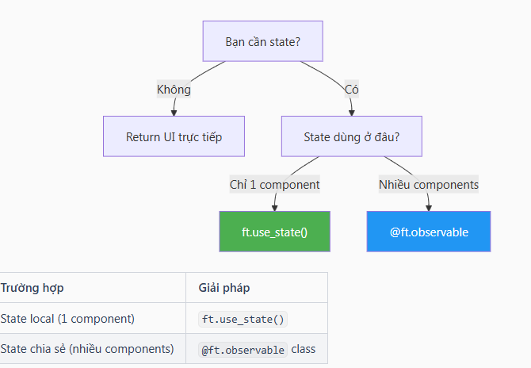

## **Components & Observables trong Flet**

**2 khái niệm quan trọng nhất của Flet 0.80:**

- @ft.component - Tạo UI components tái sử dụng
- @ft.observable - Quản lý state tự động cập nhật UI

**@ft.component - Tạo Component**

Component là **hàm trả về UI**, có thể tái sử dụng:

**Quy tắc viết Component**
- Đánh dấu với @ft.component
- Tên hàm viết PascalCase (Greeting, UserCard…)
- Return một control duy nhất (dùng Column/Row để gom nhiều controls)

**@ft.observable - Quản lý State toàn cục**

Observable là class **lưu trữ state dùng chung**, tự động cập nhật UI khi thay đổi:

import flet as ft
from dataclasses import dataclass

    # Định nghĩa observable class
    @ft.observable
    class AppState:
        count: int = 0
        
        def increment(self):
            self.count += 1
        
        def decrement(self):
            self.count -= 1
    
    @ft.component
    def Counter():
        # Tạo instance
        state, _ = ft.use_state(AppState())

        return ft.Row([
            ft.IconButton(ft.Icons.REMOVE, on_click=lambda _: state.decrement()),
            ft.Text(str(state.count), size=24),  # 👈 Tự động cập nhật khi count thay đổi
            ft.IconButton(ft.Icons.ADD, on_click=lambda _: state.increment()),
        ], alignment=ft.MainAxisAlignment.CENTER)
    
    def main(page: ft.Page):
        
        page.window.width = 500
        page.window.height = 600 
        
        page.render(Counter)
    
    # ft.run(lambda page: page.render(Counter))
    ft.run(main)

**Observable với Collections**

    import flet as ft
    
    @ft.observable
    class TodoState:
        items: list = []
        
        def add(self, text: str):
            self.items.append({"id": len(self.items), "text": text, "done": False})
        
        def toggle(self, id: int):
            for item in self.items:
                if item["id"] == id:
                    item["done"] = not item["done"]
                    break
    
    state = TodoState()
    
    @ft.component
    def TodoItem(item):
        return ft.ListTile(
            leading=ft.Checkbox(
                value=item["done"],
                on_change=lambda _: state.toggle(item["id"]),
            ),
            title=ft.Text(
                item["text"],
                style=ft.TextStyle(
                    decoration=ft.TextDecoration.LINE_THROUGH if item["done"] else None
                ),
            ),
        )
    
    @ft.component
    def TodoList():
        input_ref, set_input = ft.use_state("")
        
        def add_todo(_):
            if input_ref:
                state.add(input_ref)
                set_input("")
        
        return ft.Column([
            ft.Row([
                ft.TextField(
                    value=input_ref,
                    hint_text="Thêm việc cần làm...",
                    expand=True,
                    on_change=lambda e: set_input(e.control.value),
                    on_submit=add_todo,
                ),
                ft.IconButton(ft.Icons.ADD, on_click=add_todo),
            ]),
            ft.Column([TodoItem(item) for item in state.items]),
        ])
    
    def main(page: ft.Page):
        page.title = "Todo App"
        page.render(TodoList)
    
    ft.run(main)

**Khi nào dùng gì?**

**Tip**
- Tách nhỏ components - Mỗi component làm một việc
- State nâng lên - Đưa state lên component cha nếu cần chia sẻ
- Observable cho app state - User data, settings, cart…
- use_state cho UI state - Form input, toggle visibility…