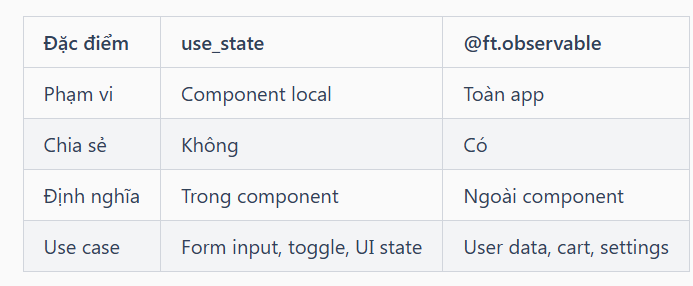

## **ft.use_state() - State Hook cơ bản**

`use_state()` tạo state local cho component, tự động re-render khi state thay đổi:

    import flet as ft
    
    @ft.component
    def Counter():
        # Khai báo state với giá trị khởi tạo
        count, set_count = ft.use_state(0)
        
        return ft.Row([
            ft.IconButton(ft.Icons.REMOVE, on_click=lambda _: set_count(count - 1)),
            ft.Text(str(count), size=24),
            ft.IconButton(ft.Icons.ADD, on_click=lambda _: set_count(count + 1)),
        ], alignment=ft.MainAxisAlignment.CENTER)
    
    def main(page: ft.Page):
        page.render(Counter)
    
    ft.run(main)

**Cách hoạt động**

    count, set_count = ft.use_state(0)
    #  │       │                    │
    #  │       │                    └── Giá trị khởi tạo
    #  │       └── Hàm để cập nhật state
    #  └── Giá trị hiện tại của state

**use_state vs Observable**

